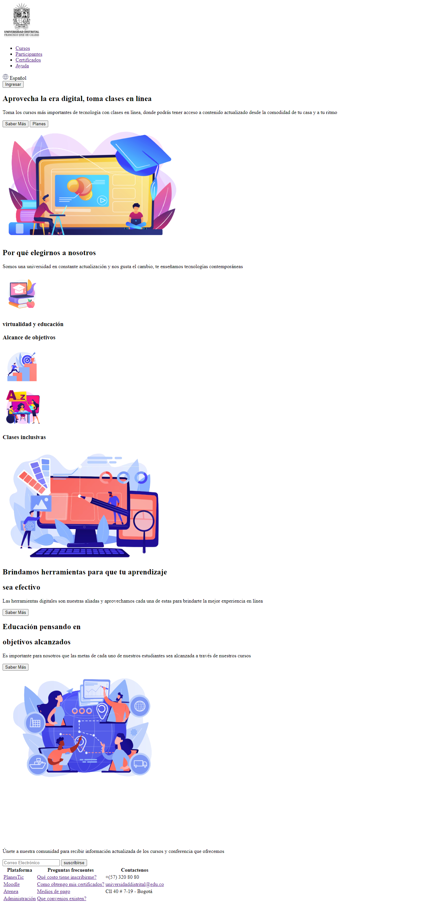

<h1>Taller 9 Luisa Fernanda Herrera Chávez </h1>

<h2> Información</h2>

Curso: full Stack Basico - Grupo 1 

Profesor: Cristian Patiño

<h2> Punto 1: Link figma</h2>
<a href="https://www.figma.com/file/ZJDCaUO80MO59MulMmHU26/Luisa-Ejercicio?type=design&node-id=0-1&t=jGYP63l0lPiwydPV-0" target="_blank">Link de Figma</a>
<h2> Punto 2: HTML</h2>

